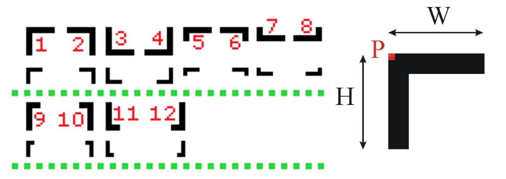

MIPS Find Marker 
================
### Implementation of searching the proper pixel in `BMP` file 

Explanation of the task:
-----------------------
The input BMP image (24-bit RGB) contains markers shown in figure below. The image may
contain other elements. Your task is to detect all markers of given type.

Characteristics of the marker 5 (our case):
------------------------------
The markers are black and consist of two arms. For a given marker type, the ratio of width W to height H is constant (2 in our case). 
Markers of a given type can be of various sizes if the proportions of the dimensions of the arms are kept. 
The marker position is determined by the point where the arms intersect (marked by `P` in figure above).

Input:
------
* BMP file containing the source image:
    * sub format: 24 bit RGB – no compression,
    * size: width 320px, height up to 240 px,
*  file name: “source.bmp” (or any other BMP file)

Output:
-------
* Console window – plain text - subsequent lines contain the coordinates of the detected markers,
eg. 10, 15. The point (0,0) is in the upper left corner of the image.

How to start:
-------------
* Download repository
* Open source file using `MARS`
* Select one of the BMP files and compile
